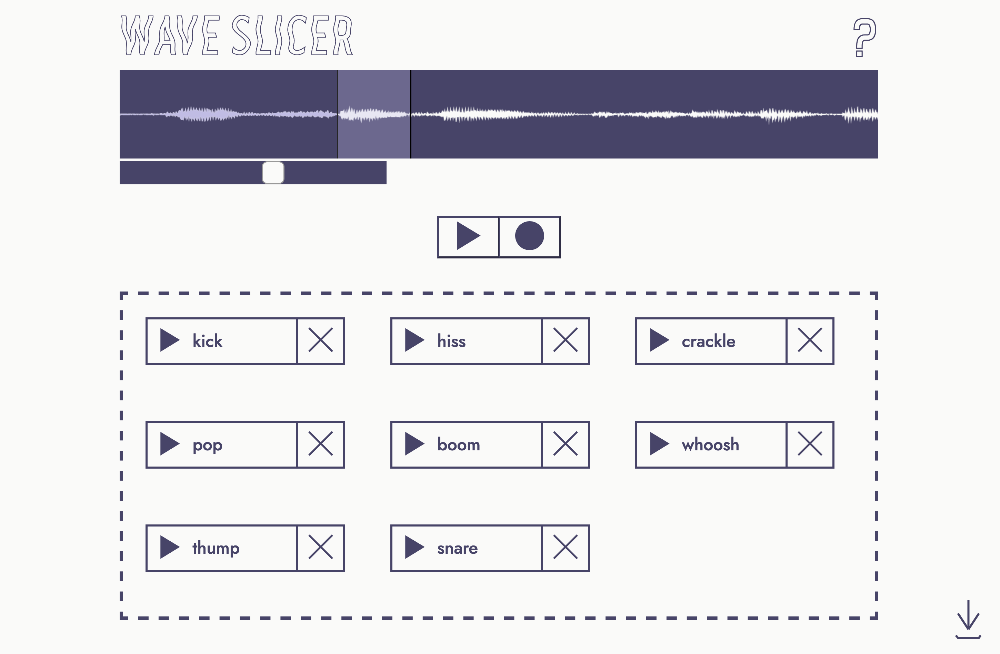

# Wave Slicer
## [Try it Out](https://wave-slicer.netlify.app/)


Wave Slicer is a web application for chopping up audio files. 

To get started drag an audio file onto the drop zone. To sample highlight a region of the waveform and click the record button. Samples will appear underneath the waveform where you can listen back, rename or delete them. Use the button that appears in the bottom right of the screen to download a zip file containing your samples.

This project is built using [React](https://reactjs.org/). [Wavesurfer.js](https://wavesurfer-js.org/) is used to display the waveform and define which regions to sample. Samples are then recorded from the audio file using the [MediaRecorder API](https://developer.mozilla.org/en-US/docs/Web/API/MediaRecorder).



## Installing Locally

Clone the repo:

    git clone https://github.com/jaqarrick/wave-slicer.git
Navigate into the ```wave-slicer``` repo and install dependencies:

    cd wave-slicer && npm i
Start the application:

    npm start

## Features to Implement
- Add a live recorder option, where samples can be sliced from audio recorded directly in browser. 
## Credits

Thanks to [Wavesurfer.js](https://wavesurfer-js.org/) and also [JSZip](https://stuk.github.io/jszip/) for making this project a whole lot easier to implement.

Build and design by [Gabriel Davison](https://github.com/gabrieldavison) and [Jack Carrick](https://github.com/jaqarrick).